# Taller de JavaScript

## Participantes

1. Esteban Bedoya
2. Camilo Rubiano 

## Ejercicios Impares

## Ejercicio #1

```javascript
var nombre = prompt("ingresar el nombre");
console.log("ahora estas en la matrix " + nombre);
```
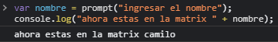

## Ejercicio #3

```javascript
var numero1 = prompt("ingrese el primer numero: ");
var numero2 = prompt("ingrese el segundo numero: ");
var suma = Number(numero1)+ Number(numero2);
console.log("Suman: " + suma);
var numero3 = prompt("ingrese el tercer numero: ");
var multiplicacion = suma * Number(numero3);
console.log("Multiplicacion de la suma por el ultimos numero: " + multiplicacion);
```
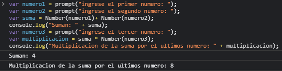

## Ejercicio #5

```javascript
var tempt = prompt("ingresar una temperatura en Farenheit: ")
var Celsius = (5/9) * (tempt-32)
console.log("En grados celsius es: "+ Celsius);

```
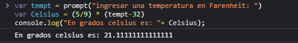

## Ejercicio #7

```javascript
var numero1 = prompt("ingrese un numero: ");
console.log("Descontando el 15% queda: " + (numero1 - numero1 * 0.15)); 
```
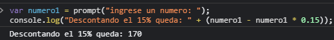

## Ejercicio #9

```javascript
var texto = prompt("ingresar un texto: ");
console.log("" + texto )
console.log("El caracter en primer lugar es :" + texto.charAt(0) )
console.log("ingrese un numero positivo menor a  " + texto.length );
var indice = prompt("");
console.log("" + indice);
var posicion = texto.charAt(indice);
console.log("El caracter en esa posicion es: " + posicion);
```
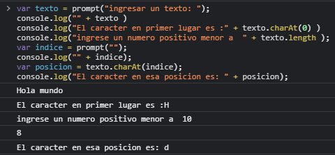

## Ejercicio 11

```javascript
var fecha = Number(prompt("Ingrese la fecha en formato DDMMAAAA: "))
console.log(fecha)
var aaaa = Math.trunc(fecha % 10000)
fecha /= 10000
var mm = Math.trunc(fecha % 100)
fecha /= 100
var dd = Math.trunc(fecha)
console.log(dd + "/" + mm + "/" + aaaa)
```
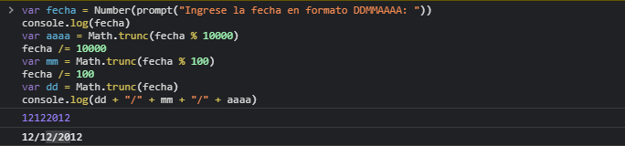

## Ejercicio #13

```javascript
var edad = prompt("Tu edad: ");
console.log(""+edad);
var articulos = prompt("articulos comprados: ");
console.log(""+articulos);
var verdad = Boolean(edad>18 && articulos>1);
console.log(""+verdad);
```
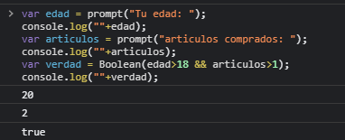

## Ejercicio #15

```javascript
var palabra1 = prompt("Una palabra: ");
console.log(""+palabra1);
var palabra2 = prompt("Otra palabra: ");
console.log(""+palabra2);
var verdad = Boolean(palabra1<palabra2);
console.log(""+verdad);
```
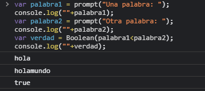

## Ejercicio #17

```javascript
var numero1 = prompt("Numero: ");
var valor = Math.abs(numero1);
console.log = (""+valor);
```
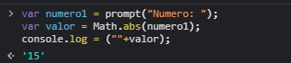

## Ejercicio #19

```javascript
var letra = prompt ("Letra: ");
var vocal= ("aeiou");
if(vocal.indexOf(letra) != -1){
alert("vocal encontrada");
}else {
    alert("No se pudo procesar el dato");

} 
```
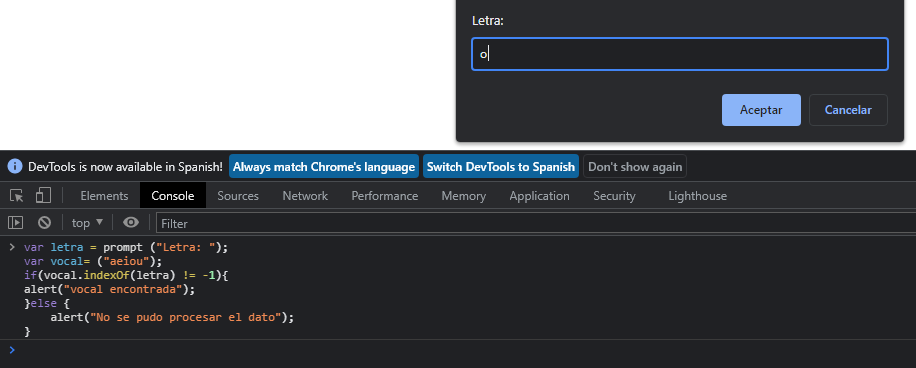
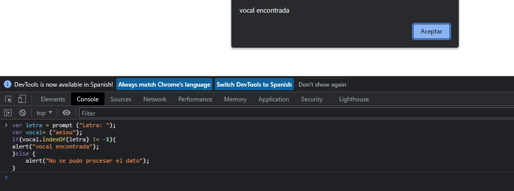

