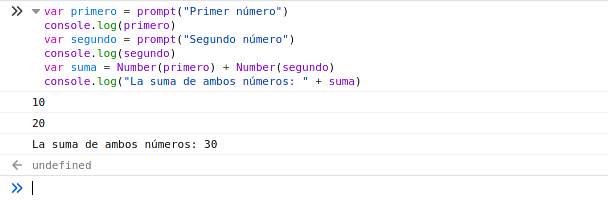
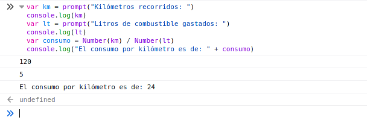
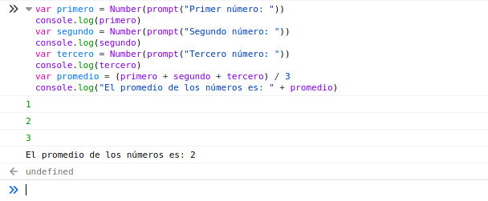
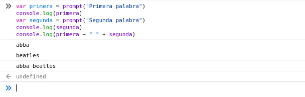
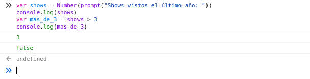
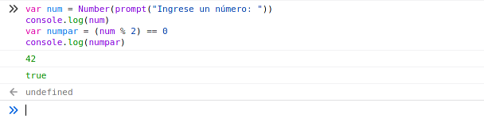
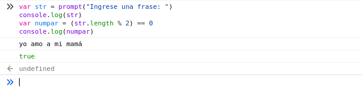
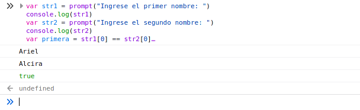
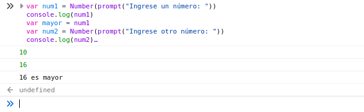
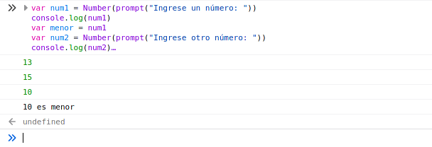

# Taller de JavaScript

***

## Ejercicio 2

```javascript
var primero = prompt("Primer número")
console.log(primero)
var segundo = prompt("Segundo número")
console.log(segundo)
var suma = Number(primero) + Number(segundo) 
console.log("La suma de ambos números: " + suma)
```



## Ejercicio 4

```javascript
var km = prompt("Kilómetros recorridos: ")
console.log(km)
var lt = prompt("Litros de combustible gastados: ")
console.log(lt)
var consumo = Number(km) / Number(lt) 
console.log("El consumo por kilómetro es de: " + consumo)
```



## Ejercicio 6

```javascript
var primero = Number(prompt("Primer número: "))
console.log(primero)
var segundo = Number(prompt("Segundo número: "))
console.log(segundo)
var tercero = Number(prompt("Tercero número: "))
console.log(tercero)
var promedio = (primero + segundo + tercero) / 3
console.log("El promedio de los números es: " + promedio)
```



## Ejercicio 8

```javascript
var primera = prompt("Primera palabra")
console.log(primera)
var segunda = prompt("Segunda palabra")
console.log(segunda)
console.log(primera + " " + segunda)
```



## Ejercicio 10

```javascript
var shows = Number(prompt("Shows vistos el último año: "))
console.log(shows)
var mas_de_3 = shows > 3
console.log(mas_de_3)
```



## Ejercicio 11

```javascript
var fecha = Number(prompt("Ingrese la fecha en formato DDMMAAAA: "))
console.log(fecha)
var aaaa = Math.trunc(fecha % 10000)
fecha /= 10000
var mm = Math.trunc(fecha % 100)
fecha /= 100
var dd = Math.trunc(fecha)
console.log(dd + "/" + mm + "/" + aaaa)
```



## Ejearcicio 12

```javascript
var num = Number(prompt("Ingrese un número: "))
console.log(num)
var numpar = (num % 2) == 0
console.log(numpar)
```

## Ejercicio 14

```javascript
var str = prompt("Ingrese una frase: ")
console.log(str)
var numpar = (str.length % 2) == 0
console.log(numpar)
```



## Ejercicio 16

```javascript
var str1 = prompt("Ingrese el primer nombre: ")
console.log(str1)
var str2 = prompt("Ingrese el segundo nombre: ")
console.log(str2)
var primera = str1[0] == str2[0]
var ultima = str1[str1.length - 1] == str2[str2.length - 1]
var out = primera || segunda
console.log(out)
```



## Ejercicio 18

```javascript
var num1 = Number(prompt("Ingrese un número: "))
console.log(num1)
var mayor = num1
var num2 = Number(prompt("Ingrese otro número: "))
console.log(num2)
if (num2 > num1)
    mayor = num2
console.log(mayor + " es mayor")
```



## Ejercicio 20

```javascript
var num1 = Number(prompt("Ingrese un número: "))
console.log(num1)
var menor = num1
var num2 = Number(prompt("Ingrese otro número: "))
console.log(num2)
if (num2 < num1)
    menor = num2
var num3 = Number(prompt("Ingrese otro número: "))
console.log(num3)
if (num3 < num2)
    menor = num3
console.log(menor + " es menor")
```


